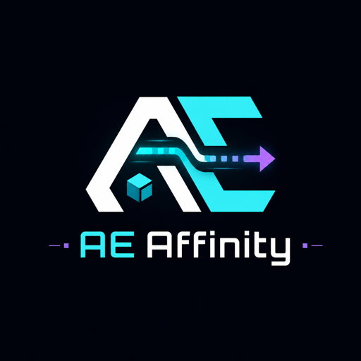

<p align="center">
  
</p>

<h1 align="center">AE Affinity</h1>

<p align="center">
  A lazy, server-side storage affinity scheduler for Applied Energistics 2.
</p>

<p align="center">
  
  
  
  
  
</p>

AE2 is excellent at consolidating an exact item key into storage that already contains it, but fixed storage priority cannot express that different media are good at different things. A drive full of cells is efficient for a few bulk types; a large slotted vault is often better for sparse, component-heavy or unstackable items. AE Affinity slowly repairs those mismatches in the background without adding another storage block or replacing AE2's normal routing.

The current MVP is deliberately headless: it registers no blocks or items, contains no client code, and is designed to be installable on a NeoForge server without requiring the addon on clients.

## Supported versions

- Minecraft 1.21.1
- NeoForge 21.1.x
- Applied Energistics 2 19.2.x
- Java 21

## How it works

Every AE grid receives a small background service. A narrow mount/unmount hook preserves the provenance that AE2 normally discards when it flattens providers into network storage. The scheduler then works in three separated phases:

```text
idle for A ticks
→ plan read-only for B ticks
→ validate and commit at most one move in one tick
```

Planning only creates cheap suggestions. A bounded placement index advances at most eight keys for one dirty endpoint per planning tick and retains a 16-entry reservoir of useful hints. Source and target selection use indexed lists with at most four target comparisons, rather than walking every endpoint or item key. Mounts, unmounts and attempted moves mark endpoints dirty immediately. Storage Bus operations also reuse AE2's wrapper callback; direct hopper, player and third-party mutations are detected by a fallback that checks at most eight standard `IItemHandler` slots per powered grid each second, with inventories over 4096 slots left to low-frequency reconciliation. Otherwise endpoints are reconciled round-robin during the already infrequent planning phase. Immediately before committing, AE Affinity resolves both endpoints again, reads current amounts, checks access and conservation properties, and asks both storages to simulate the whole micro-transfer.

The actual `extract → insert → return remainder` sequence completes synchronously in the same server tick. By default the insertion uses AE2's energy service and the same powered helper as the I/O Port. Servers can set `chargeEnergy=false` to make background insertion free; the grid must still be powered for the scheduler to run. No item remains in flight between ticks.

The interval is adaptive. Useful work brings the scheduler back toward its configured minimum; stable rounds exponentially back off toward the maximum. The defaults range from 10 seconds to 15 minutes.

### Current automatic affinity

- Ordinary AE item cells prefer existing keys, stackable bulk items and numerous identical items.
- Direct standard slotted containers behind a storage bus prefer a few sparse unstackable items.
- Sparse unstackables of an exact key, currently up to four, can move from cells to slotted storage.
- Numerous unstackables and ordinary bulk stacks can move back toward cells.
- Child ME networks, custom cells and genuinely unknown storage remain opaque instead of being guessed.
- Extract-only sources, insert-only targets, voiding storage and unknown conservation semantics are excluded from automatic movement.

This is intentionally a small first policy, not a claim of global optimality. The endpoint-reporting layer is designed to grow into subnetwork aggregation and mod-specific affinity adapters without changing the scheduler.

## Installation and activation

1. Install NeoForge, AE2 and GuideME on the server.
2. Place the AE Affinity JAR in the server's `mods/` directory.
3. Join as an operator, look directly at an AE block in the network, and run:

```text
/aeaffinity enable
```

The block does **not** have to be an ME Controller. Any loaded AE node works, including a Drive, Interface or Controller. That node becomes a persistent activation anchor for whichever AE grid currently contains it.

The coordinate forms remain available for the server console, command blocks and automation:

```text
/aeaffinity enable <x> <y> <z>
/aeaffinity disable [<x> <y> <z>]
/aeaffinity status [<x> <y> <z>]
```

Without coordinates, player commands use the AE block under the crosshair within eight blocks.

Why an anchor instead of a network ID? AE grids are runtime objects: cable changes can split or merge them, and they are reconstructed after reload. The coordinate is used only to locate an AE node when the command runs; the anchor flag is persisted with that node's AE grid-service data, not in a global coordinate list. Breaking the block removes the node and its anchor, while unloading and reloading its chunk restores the flag with the node. If a network splits, only the side containing an anchor remains enabled; when networks merge, the merged grid is enabled if it contains at least one anchor.

The default mode is `ANCHORED`, so installing the addon does not immediately rearrange every player's storage. Set `activation=ALL` to enable every grid or `OFF` to pause scheduling globally. NeoForge generates `config/aeaffinity-server.toml` with the activation mode, `chargeEnergy=true` and scheduler speed bounds.

## Build and verify

```bash
export JAVA_HOME=/opt/homebrew/opt/openjdk@21
./gradlew verifyAll
```

`verifyAll` runs the ordinary unit suite, builds the distributable JAR, and starts a headless NeoForge GameTest server. The GameTests construct real powered AE grids with a Drive, item cell, storage bus and chest. They verify sparse and bulk migration, exact conservation, full-target rejection, endpoint removal, Void Card exclusion, access direction, removal of a destroyed activation anchor, and prompt wake-up when a backed-off grid's chest is changed externally. Test-only classes and structures are excluded from the release JAR.

## Safety boundary

AE Affinity follows AE2's own synchronous transfer model rather than keeping a cross-tick escrow. Normal player actions cannot interleave with the extraction and insertion calls inside one server tick. A JVM crash at exactly that point, or a broken third-party storage that mutates and then throws, is outside this guarantee. Unknown, voiding, one-way and alias-ambiguous endpoints are therefore conservative by default.

## Roadmap

- Aggregate affinity reports at storage buses connected to child ME networks.
- Data-driven affinity profiles for third-party storage mods and modpacks.
- Dedicated dirty adapters for externally mutated high-churn containers.
- Real-network profiling and tuning on large modded servers.
- Optional status UI only if the headless commands prove insufficient.

CI is intentionally absent for now; the project is verified locally to preserve limited GitHub Actions quota.

## License

Code is available under the [MIT License](LICENSE). Applied Energistics 2 is a separate project and dependency. The project logo is original artwork supplied specifically for AE Affinity and does not reuse the AE2 logo.
